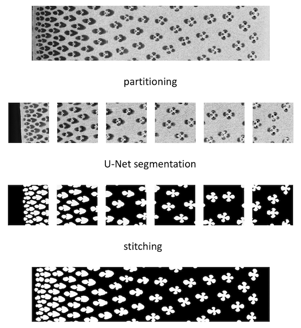

# Segmentation and morphmetry of vasucular bundle

> Tsuyama et al: Quantitative morphological transformation of vascular bundles in the culm of moso bamboo (Phyllostachys pubescens) DOI: 10.1371/journal.pone.0290732
>
> 

### Directory structure

Under the job number (ex. 001), following directory will be generated.

```
.
├── extracted_VB_images
├── model
├── morphology
├── segmentation
└── train
  ├── image
  └── mask
```

The original dataset, pairs of image and the correponding mask, for building u-net model should be placed in train directory

```
└── train
    ├── image
    │   ├── 0.png
    │   ├── 1.png
    │   └── 2.png
    └── mask
        ├── 0.png
        ├── 1.png
        └── 2.png
```

### Jupyter notebook

001: Building u-net model

002: Segmentation using u-net model

003: Measurement of morphological parameters


### Flow chart 



### Data used in the paper

26 microscope images and corresponding mask images (1575 × 6150) are available upon request.

Please mail to the corresponding author.


### References

#### The gerenative network for segmentation was referenced from  U-Net

> [ U-Net: Convolutional Networks for Biomedical Image Segmentation ](https://lmb.informatik.uni-freiburg.de/people/ronneber/u-net/)
>
> Olaf Ronneberger, Philipp Fischer, Thomas Brox:  Medical Image Computing and Computer-Assisted Intervention (MICCAI), Springer, LNCS, Vol.9351: 234--241, 2015, available at [arXiv:1505.04597 [cs.CV\]](http://arxiv.org/abs/1505.04597)

#### U-Net coding

> The network structure was constructed by referring to the following website.https://github.com/zhixuhao/unet/blob/master/README.md

